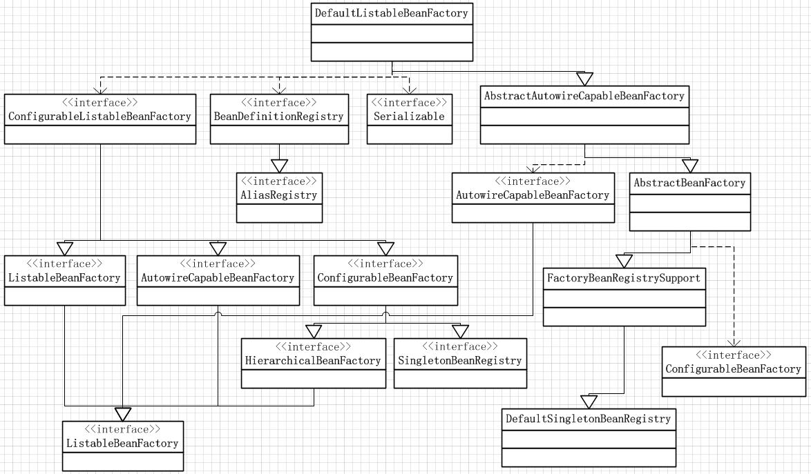
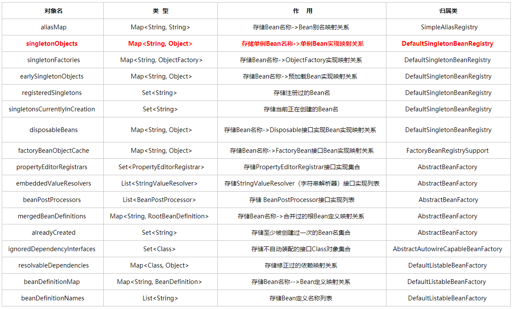
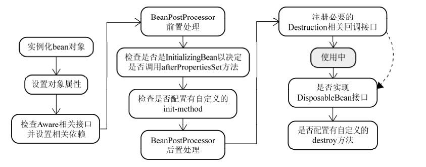

## Spring - IOC

[给容器中注册组件的方式](#给容器中注册组件的方式)  
[Bean的初始化](#Bean的初始化)  
[条件注册Bean](#条件注册Bean)  
[Bean创建后和销毁前的操作](#Bean创建后和销毁前的操作)  
[自定义组件扫描过滤器](#自定义组件扫描过滤器)  
[BeanPostProcessor](#BeanPostProcessor)  
[@Value](#@Value)  
[@Qualifier指定选择Bean ](#@Qualifier指定选择Bean )  
[@Primary优先选择Bean](#@Primary优先选择Bean)  
[@Autowired](#@Autowired)  
[@Autowired和@Resource两个注解的区别：](#@Autowired和@Resource两个注解的区别：)  
[@inject](#@inject)  
[练习](#练习)  
[Aware](#Aware)  
[FactoryBean和BeanFactory](#FactoryBean和BeanFactory)  
[Spring-BeanPostProcessor](#Spring--BeanPostProcessor)  
[IOC对Bean的初始化流程](#IOC对Bean的初始化流程)  

#### 给容器中注册组件的方式
1. @Bean：导入第三方的类或包的组件 bean的名称默认为方法名，也可以自己指定
```java
@Bean("newBeanName")   //bean的id默认为方法名，也可以自己指定
public Person person(){
    return new Person();
}
```
2. @ComponentScan：@Controller @Service @Reponsitory @Componet 一般用于自己写的类
springboot的启动器会自动扫描同包或子包下的组件，注意不要移动启动器的位置
3. @Import：快速给容器导入一个组件，id为全类名,还提供了ImportSelector接口和ImportBeanDefinitionRegistrar接口
```java
//@Import导入的三种方式
//1)直接导入
 @Import(User.class)

//2)ImportSelector接口
@Import(value={User.class,MyImportSelector.class})
public class MyImportSelector implements ImportSelector{
    public String [] ...(){
        return new String[]{"com.lwj.pojo.User","com.lwj.pojo.Task"} //返回要导入组件的全类名数组
    }
}

//3)ImportBeanDefinintionRegistrar接口
@Import(value={User.class,MyImportBeanDefinitionRegistrar.class})
public class MyImportBeanDefinitionRegistrar implements ImportBeanDefinitionRegistrar{
     public void registerBeanDefinitions(AnnotationMetadata importingClassMetadata, BeanDefinitionRegistry registry) {
        RootBeanDefinition rootBeanDefinition = new RootBeanDefinition(Person.class);
        registry.registerBeanDefinition("person",rootBeanDefinition);
    }
}

```


#### Bean的初始化
ApplicationContext app= new ClassPathXmlApplicationContext("applicationContext.xml")  
```xml
<bean id="person" class="com.lwj.bean.Person"></bean>
```
ApplicationContext app= new AnnotationConfigApplicationContext(MyConfig.class);

```java
@Configuration
public class MyConfig{
    @Bean("newBeanName")   //bean的名称默认为方法名，也可以自己指定
    @Scope("prototype")  //默认单例，随容器启动而创建，prototype为多例，在被使用时创建
    @Lazy   //使用懒加载，针对单例的Bean
    public Person person(){
        return new Person();
    }
}
```


#### 条件注册Bean
1.实现Condition接口  
2.使用@Conditional注解配置
```java
public class MyCondition implements  Condition{
    public boolean matches(ConditionContext context ...){
        //获取到IOC容器正在使用的beanFactory
        ConfigurableListableBeanFactory beanFactory= context.getBeanFactory()
        if(...){
            return true;
        }
        return false;
    }
}

@Conditional(MyCondition.class)
@Bean
public Person person(){
    return new Person();
}
```


#### Bean创建后和销毁前的操作
```java
//1.使用@Bean控制创建后和销毁前的操作
@Bean(value = "person",initMethod = "personInit", destroyMethod = "personDestory")
public Person getPerson(){}

public class Person{
    ...
    void personInit()
    void personDestory()
}

//2.Bean实现InitializingBean，DisposableBean接口来控制创建后和销毁前的操作
public class Person implements InitializingBean, DisposableBean {
    public void afterPropertiesSet() throws Exception {}
    public void destroy() throws Exception {}
}

//3.使用 @PostConstruct @PreDestory
public class Bike{
     @PostConstruct
    public void postConstruct() {}

    @PreDestroy
    public void preDestroy() {}
}

//以上三种方式调用的先后顺序
@Configuration
public class InitializingBeanConfig {
    @Bean(initMethod = "initMethod",destroyMethod = "destroyMethod")
    public Bike bike(){
        return new Bike();
    }
}

public class Bike implements InitializingBean, DisposableBean {
    public Bike() {
        System.out.println("Bike...Constructor");
    }

    public void initMethod() {
        System.out.println("1-Bike...initMethod");
    }

    public void destroyMethod() {
        System.out.println("1-Bike...destroyMethod");
    }

    @overwrite
    public void afterPropertiesSet() throws Exception {
        System.out.println("2-Bike...afterPropertiesSet");
    }

    @overwrite
    public void destroy() throws Exception {
        System.out.println("2-Bike...destroy");
    }

    @PostConstruct
    public void postConstruct() {
        System.out.println("3-Bike...postConstruct");
    }

    @PreDestroy
    public void preDestroy() {
        System.out.println("3-Bike...preDestroy");
    }
}
/**
Bike...Constructor  //调用无参构造方法
3-Bike...postConstruct  //在bean调用Construct创建完成后，赋值之前进行初始化，属于JDK的注解
2-Bike...afterPropertiesSet //在属性设置之后调用的初始化方法,底层使用类型强转.方法名()进行直接方法调用
1-Bike...initMethod     //正式的初始化方法,底层使用反射，与Spring解耦但相较InitializingBean接口效率低
app容器初始化完成
3-Bike...preDestroy     //在bean被移除之前进行通知，在容器销毁之前进行清理工作，属于JDK的注解
2-Bike...destroy        //bean销毁时，会把单例bean进行销毁，底层使用类型强转.方法名()进行直接方法调用
1-Bike...destroyMethod  //正式的销毁方法,底层使用反射，与Spring解耦但效率低
**/

//4.BeanPostProcessorsr接口 
public class Bike implements  BeanPostProcessor {
    @Override
    public Object postProcessBeforeInitialization(Object bean, String beanName) throws BeansException {
        System.out.println("4-Bike...postProcessBeforeInitialization..."+bean.toString()+"..."+beanName);
        return bean;
    }

    @Override
    public Object postProcessAfterInitialization(Object bean, String beanName) throws BeansException {
        System.out.println("4-Bike...postProcessAfterInitialization..."+bean.toString()+"..."+beanName);
        return bean;
    }
}


// BeanPostProcessors Bean的后置处理器其实是在Bean正式调用initMethod前后对Bean进行增强
// AbstractAutowireCapableBeanFactory类中的源码如下
/**
wrappedBean = applyBeanPostProcessorsBeforeInitialization(wrappedBean, beanName);
...
invokeInitMethods(beanName, wrappedBean, mbd);
...
wrappedBean = applyBeanPostProcessorsAfterInitialization(wrappedBean, beanName);
**/
```

#### 自定义组件扫描过滤器
1.实现TypeFilter接口  
2.进行注解配置
```java
@ComponentScan(value = "com.lwj" ,includeFilters={  
    @Filter(type=FilterType.CUSTOM,classes={MyTypeFilter.class})
},userDefaultFilters=false )
```


#### BeanPostProcessor
```java
// 示例：
InitDestroyAnnotationBeanPostProcessor
    @PreDestroy
    @PostConstruct

AutowiredAnnotationBeanPostProcessor
    @AutoWired 
```

#### @Value
```java
public class Person{
@Value("jack")
private String name="rose"; //打印的还是jack

@Value("${com.mysql.username}")
private String name;
}

@PropertySource(value="classpath:mysql.properties")
public class MyConfig
```

#### @Qualifier指定选择Bean  
``` java
@Qualifier("testDao2")  //指定要注入的Bean
@Autowired     //@ComponentScan扫描到的比使用@Bean注册的优先级高？？
private TestDao testDao;
```
#### @Primary优先选择Bean
```java
@Primary
@Bean
public TestDao testDao(){}
```
#### @Autowired
```java
//先根据bean的名称，再根据Bean的类型
@Autowired(required=false)  //找不到需要被注入的Bean也不会报错
private TestDao testDao;
```
#### @Resource
1. 不支持Primary功能
2. 不支持Autowired(required=false),如果匹配不到会报错
3. @Resource后面没有任何内容，默认通过name属性去匹配bean，找不到再按type去匹配
4. 指定了name或者type则根据指定的类型去匹配bean
5. 指定了name和type则根据指定的name和type去匹配bean，任何一个不匹配都将报错

#### @Autowired和@Resource两个注解的区别：
1. @Autowired默认按照byType方式进行bean匹配，@Resource默认按照byName方式进行bean匹配
2. @Autowired是Spring的注解，@Resource是J2EE的注解，这个看一下导入注解的时候这两个注解的包名就一清二楚了
3. Spring属于第三方的，J2EE是Java自己的东西，因此，建议使用@Resource注解，以减少代码和Spring之间的耦合。

#### @inject
1. 第三方jar，需要pom.xml添加依赖，不依赖Spring，适合非Spring项目的依赖注入
2. 不支持Autowired(required=false)

Spring自带的@Autowired的缺省情况等价于JSR-330的@Inject注解； Spring自带的@Qualifier的缺省的根据Bean名字注入情况等价于JSR-330的@Named注解； Spring自带的@Qualifier的扩展@Qualifier限定描述符注解情况等价于JSR-330的@Qualifier注解。

## 练习
```java
// 1. 组件扫描 的方式的添加组件
@Component
public class Person{}

@Component
public class School {
    @Autowired
    private Person person;}

@Configuration
@ComponentScan("com.lwj.beanInit.wiredBeanTest")
public class MyConfig {}

School school = app.getBean(School.class);
school.printPerson();


// 2. @Bean 的方式添加组件
@Configuration
public class MyConfig {
    @Bean
    public School school(){
        return new School();}

    @Bean
    public Person person(){
        return new Person();}

School school = app.getBean(School.class);
school.printPerson();


// 3.1 @Qualifier 注入指定名称的Bean
//如果有多个同类型的Bean，无法单独使用@Autowired，可以搭配@Qualifier
@Configuration
public class MyConfig {
    @Bean
    public School school() {
        return new School();}

    @Bean
    public Person jack() {
        Person person = new Person();
        person.setName("jack");
        return person;}

    @Bean
    public Person tom() {
        Person person = new Person();
        person.setName("tom");
        return person;}}

public class School {
    @Qualifier("tom")
    @Autowired
    private Person person;}


// 3.2 @Primary  优先选择带有@Primary注解的Bean
//如果有多个同类型的Bean，无法单独使用@Autowired，搭配@Primary也可以，但优先级比@Qualifier低
@Configuration
public class MyConfig {
    @Bean
    public School school() {
        return new School();}
Primary
    @Bean
    @Primary
    public Person jack() {
        Person person = new Person();
        person.setName("jack");
        return person;}

    @Bean
    public Person tom() {
        Person person = new Person();
        person.setName("tom");
        return person;}}

public class School {
    @Autowired
    private Person person;}

```


#### Aware
BeanNameAware、ApplicationContextAware和BeanFactoryAware  
"Aware"的意思是"感知到的"，实现对应的Aware接口可以获取相应的容器  
1. 实现BeanNameAware接口的Bean，在Bean加载的过程中可以获取到该Bean的id
2. 实现ApplicationContextAware接口的Bean，在Bean加载的过程中可以获取到Spring的ApplicationContext，ApplicationContext是Spring应用上下文，从ApplicationContext中可以获取包括任意的Bean在内的大量Spring容器内容和信息
3. 实现BeanFactoryAware接口的Bean，在Bean加载的过程中可以获取到加载该Bean的BeanFactory

EnvironmentAware  获取操作系统环境容器
ApplicationContextAware 获取IOC容器
BeanNameAware   获取Bean名称
EmbeddedValueResolverAware  获取字符串解析器  如：@Value("${name}")
```java
public class Person implements ApplicationContextAware {
    private ApplicationContext applicationContext;

    public ApplicationContext getApplicationContext(){
        return applicationContext;
    }
    @Override
    public void setApplicationContext(ApplicationContext applicationContext) throws  {
        this.applicationContext = applicationContext;
    }
}
```


#### FactoryBean和BeanFactory
FactoryBean：自定义Bean  
BeanFactory：从容器中获取或创建实例化的Bean  

FactoryBean:  
传统的Spring容器加载一个Bean的整个过程，都是由Spring控制的，换句话说，开发者除了设置Bean相关属性之外，是没有太多的自主权的  
FactoryBean改变了这一点，开发者可以个性化地定制自己想要实例化出来的Bean，方法就是实现FactoryBean接口  

- getObject()方法是最重要的，控制Bean的实例化过程
- getObjectType()方法获取接口返回的实例的class
- isSingleton()方法获取该Bean是否为一个单例的Bean

```java
public class MyFactoryBean implements FactoryBean<Person> {
    public Person getObject() throws Exception {
        return new Person();
    }

    public Class<?> getObjectType() {
        return Person.class;
    }

    public boolean isSingleton() {
        return true;
    }
}

class MyImportBeanDefinitionRegistrar implements ImportBeanDefinitionRegistrar{
    @Override
    public void registerBeanDefinitions(AnnotationMetadata importingClassMetadata, BeanDefinitionRegistry registry) {
        registry.registerBeanDefinition("person",new RootBeanDefinition(MyFactoryBean.class));
    }
}

@Configuration
//方式一：@Import({MyFactoryBean.class})  FactoryBean生产的Bean的Id为MyFactoryBean的全类名
//方式二：使用ImportBeanDefinitionRegistrar对bean进行注册，可以指定bean的id
@Import({MyImportBeanDefinitionRegistrar.class})  
public class FactoryBeanConfig {

    //方式三：使用@Bean来注册，方便快捷
    @Bean("person")
    public MyFactoryBean myFactoryBean() {
        return new MyFactoryBean();
    }


}
```

#### Spring--BeanPostProcessor
Spring通过不同的BeanPostProcessor来实现不同功能，对标有不同注解的类执行相应的BeanPostProcessor

@PreDestroy  @PostConstruct  
InitDestroyAnnotationBeanPostProcessor  

@AutoWired  
AutowiredAnnotationBeanPostProcessor  

InstantiationAwareBeanPostProcessor
负责Bean的实例化
- 实例化----实例化的过程是一个创建Bean的过程，即调用Bean的构造函数，单例的Bean放入单例池中
- 初始化----初始化的过程是一个赋值的过程，即调用Bean的setter，设置Bean的属性
之前的BeanPostProcessor作用于初始化前后，InstantiationAwareBeanPostProcessor则作用于实例化前后，
我们不会直接实现InstantiationAwareBeanPostProcessor接口，而是会采用继承InstantiationAwareBeanPostProcessorAdapter这个抽象类的方式来使用。
```java
public class InstantiationAwareBeanPostProcessorBean implements InstantiationAwareBeanPostProcessor
{
    public Object postProcessAfterInitialization(Object bean, String beanName) throws BeansException
    {
        System.out.println("Enter After Initialization()");
        return bean;
    }

    public Object postProcessBeforeInitialization(Object bean, String beanName) throws BeansException
    {
        System.out.println("Enter Before Initialization()");
        return bean;
    }

    public boolean postProcessAfterInstantiation(Object bean, String beanName) throws BeansException
    {
        System.out.println("Enter After Instantiation()");
        return true;
    }

    public Object postProcessBeforeInstantiation(Class<?> bean, String beanName) throws BeansException
    {
        System.out.println("Enter Before Instantiation()");
        return null;
    }

    public PropertyValues postProcessPropertyValues(PropertyValues pvs, PropertyDescriptor[] pd, Object bean,
            String beanName) throws BeansException
    {
        return pvs;
    }
}
```
//实例化
Enter Enter Before Instantiation()
Enter CommonBean's constructor
Enter Enter Before Instantiation()
Enter CommonBean.setCommonName(), commonName = common
//初始化
Enter Enter Before Initialization()
Enter Enter After Initialization()


#### Spring--BeanFactoryPostProcessor  
BeanPostProcessor接口针对的是每个Bean初始化前后做的操作而BeanFactoryPostProcessor接口针对的是所有Bean实例化前的操作  
BeanFactoryPostProcessor接口方法调用时机是任意一个自定义的Bean被反射生成出来前。
```java
public class FactoryPostProcessorBean implements BeanFactoryPostProcessor
{
    public void postProcessBeanFactory(ConfigurableListableBeanFactory configurablelistablebeanfactory)
            throws BeansException
    {
        System.out.println("Enter FactoryPostProcessorBean.postProcessBeanFactory()\n");
    }
}

Enter FactoryPostProcessorBean.postProcessBeanFactory()

Enter ProcessorBean.postProcessBeforeInitialization()
Enter CommonBean.initMethod(), commonName = common0
Enter ProcessorBean.postProcessAfterInitialization()

Enter ProcessorBean.postProcessBeforeInitialization()
Enter CommonBean.initMethod(), commonName = common1
Enter ProcessorBean.postProcessAfterInitialization()

Enter ProcessorBean.postProcessBeforeInitialization()
Enter ProcessorBean.postProcessAfterInitialization()
```
- BeanFactoryPostProcessor的执行优先级高于BeanPostProcessor
- BeanFactoryPostProcessor的postProcessBeanFactory()方法只会执行一次
- 该方法中自带的参数 configurablelistablebeanfactory 它携带了Bean的元信息，可以在Bean创建之前，修改Bean的生命周期，还可以通过该参数还添加BeanPostProcessor   
例如：将Bean的scope从singleton改变为prototype，还有PropertyPlaceholderConfigurer，替换xml文件中的占位符，替换为properties文件中相应的key对应的value，


#### IOC对Bean的实例化流程

refresh() ->   
- prepareRefresh();     准备刷新前的工作    
- ConfigurableListableBeanFactory beanFactory = obtainFreshBeanFactory();    创建并返回beanFactory 　　　
    - refreshBeanFactory();
        - DefaultListableBeanFactory beanFactory = createBeanFactory(); 　　　DefaultListableBeanFactory类是构造Bean的核心类  
　DefaultListableBeanFactory的继承结构  
　  
　DefaultListableBeanFactory中存储的对象  
　
- finishBeanFactoryInitialization(beanFactory);    完成非懒加载的单例bean的创建   
    - beanFactory.preInstantiateSingletons();   实例化所有剩余的(非惰性初始化)单例bean    
        - getMergedLocalBeanDefinition(beanName)　　RootBeanDefinition 继承 AbstractBeanDefinition，该方法是将Spring默认创建的AbstractBeanDefinition转为RootBeanDefinition
        - getBean(beanName)
            - doCreateBean(beanName, mbdToUse, args);
                - instanceWrapper = createBeanInstance(beanName, mbd, args);  此时已经将实例创建完成


#### IOC对Bean的初始化流程



容器启动加载配置类 -> refresh() -> finishBeanFactoryInitialization() -> beanFactory.getBean( )-> createBean(beanName, mbd, args) -> doCreateBean(beanName, mbdToUse, args)->   
-> createBeanInstance(beanName, mbd, args) 创建Bean的实例  
-> applyMergedBeanDefinitionPostProcessors(mbd, beanType, beanName); 允许后处理程序修改合并的bean定义  
-> populateBean(beanName, mbd, instanceWrapper); 属性赋值  
   - postProcessPropertyValues(pvs, filteredPds, bw.getWrappedInstance(), beanName);    完成属性赋值  

-> initializeBean(beanName, exposedObject, mbd) 对创建的Bean实例初始化
-   invokeAwareMethods(beanName, bean);   向Bean中注入相关容器  
-   applyBeanPostProcessorsBeforeInitialization(wrappedBean, beanName);
-   invokeInitMethods(beanName, wrappedBean, mbd);    
    - boolean isInitializingBean = (bean instanceof InitializingBean);  判断是否实现InitializngBean接口   
    - String initMethodName = mbd.getInitMethodName();  尝试获取Init-method
-   applyBeanPostProcessorsAfterInitialization(wrappedBean, beanName);

-> registerDisposableBeanIfNecessary(beanName, bean, mbd);  如果Bean实现DisposeBean接口，则会注册相关处理方法  
-   if (!mbd.isPrototype() && requiresDestruction(bean, mbd)) {} Spring容器不对多例的bean进行管理  


#### Spring
injectionMetadataCache  存放注解的元数据


#### Spring中的设计模式
```java
instanceWrapper = createBeanInstance(beanName, mbd, args);
/* 
 * 该接口负责根据RootBeanDefinition创建对应的Bean.
 * 由于各种方法都是可能的，所以将其纳入策略中,
 * 包括使用CGLIB动态创建子类来支持方法注入
 */
InstantiationStrategy instantiationStrategy = new CglibSubclassingInstantiationStrategy();
CglibSubclassingInstantiationStrategy extend SimpleInstantiationStrategy implements InstantiationStrategy   
```


#### refresh()
```java
// Prepare this context for refreshing.
//  进行容器刷新前的准备工作, 记录下容器的启动时间、标记“已启动”状态、处理配置文件中的占位符
prepareRefresh();

// Tell the subclass to refresh the internal bean factory.
//  获取BeanFactory，实例类型为DefaultListableBeanFactory
// 这步比较关键，这步完成后，配置文件就会解析成一个个 Bean 定义，注册到 BeanFactory 中，
// 当然，这里说的 Bean 还没有实例化，只是配置信息都提取出来了，
// 注册也只是将这些信息都保存到了注册中心(说到底核心是一个 beanName-> beanDefinition 的 map)
ConfigurableListableBeanFactory beanFactory = obtainFreshBeanFactory();

// Prepare the bean factory for use in this context.
//  对BeanFactory做一些准备工作，如准备类加载器和配置BeanFactory的容器回调
// 设置 BeanFactory 的类加载器，添加几个 BeanPostProcessor，手动注册几个特殊的 bean
prepareBeanFactory(beanFactory);

// Allows post-processing of the bean factory in context subclasses.
//  允许在上下文子类中对bean工厂进行后处理
// 【这里需要知道 BeanFactoryPostProcessor 这个知识点，Bean 如果实现了此接口，
// 那么在容器初始化以后，Spring 会负责调用里面的 postProcessBeanFactory 方法。】
// 这里是提供给子类的扩展点，到这里的时候，所有的 Bean 都加载、注册完成了，但是都还没有初始化
// 具体的子类可以在这步的时候添加一些特殊的 BeanFactoryPostProcessor 的实现类或做点什么事
postProcessBeanFactory(beanFactory);

// Invoke factory processors registered as beans in the context.
//在所有非懒加载的单例Bean实例化之前调用一次实现BeanFactoryPostProcessor接口的方法，对实现了PriorityOrdered、Order和没有实现Order接口的方法的优先级区分
invokeBeanFactoryPostProcessors(beanFactory);

// Register bean processors that intercept bean creation.
//  注册实现了BeanPostProcessor接口的方法，也进行了优先级的区分，实现控制调用顺序
registerBeanPostProcessors(beanFactory);

// Initialize message source for this context.
//  initMessageSource方法用于初始化MessageSource，MessageSource是Spring定义的用于实现访问国际化的接口
initMessageSource();

// Initialize event multicaster for this context.
//  initApplicationEventMulticaster方法是用于初始化上下文事件广播器的，观察者模式的经典示例
initApplicationEventMulticaster();

// Initialize other special beans in specific context subclasses.
 // 从方法名就可以知道，典型的模板方法(钩子方法)，
// 具体的子类可以在这里初始化一些特殊的 Bean（在初始化 singleton beans 之前）
onRefresh();

// Check for listener beans and register them.
//  用于注册监听器
registerListeners();

// Instantiate all remaining (non-lazy-init) singletons.
// *完成非懒加载单实例Bean的实例化和初始化
finishBeanFactoryInitialization(beanFactory);

// Last step: publish corresponding event.
//  结束Spring上下文刷新
finishRefresh();
```