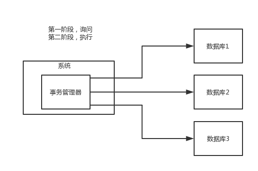
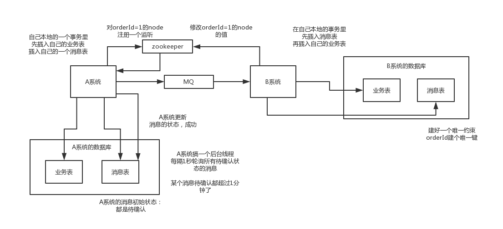

## 解决分布式事务
随着分布式服务架构的流行与普及，原来在单体应用中执行的多个逻辑操作，现在被拆分成了多个服务之间的远程调用。虽然服务化为我们的系统带来了水平伸缩的能力，然而随之而来挑战就是分布式事务问题，多个服务之间使用自己单独维护的数据库，它们彼此之间不在同一个事务中，假如A执行成功了，B执行却失败了，而A的事务此时已经提交，无法回滚，那么最终就会导致两边数据不一致性的问题；尽管很早之前就有基于两阶段提交的XA分布式事务，但是这类方案因为需要资源的全局锁定，导致性能极差；因此后面就逐渐衍生出了消息最终一致性、TCC等柔性事务的分布式事务方案。

## 分布式事务
分布式事务的实现主要有以下 5 种方案：

- XA 方案
- TCC 方案
- 本地消息表方案
- 可靠消息最终一致性方案
- 最大努力通知方案

### XA 方案/两阶段提交方案
跨库操作的分布式事务处理方案，一般一个服务只能访问自己的数据库，不允许跨库操作

所谓的 XA 方案，即：两阶段提交，有一个事务管理器的概念，负责协调多个数据库（资源管理器）的事务，事务管理器先问问各个数据库你准备好了吗？如果每个数据库都回复 ok，那么就正式提交事务，在各个数据库上执行操作；如果任何其中一个数据库回答不 ok，那么就回滚事务。

这种分布式事务方案，比较适合单块应用里，跨多个库的分布式事务，而且因为严重依赖于数据库层面来搞定复杂的事务，效率很低，绝对不适合高并发的场景。如果要玩儿，那么基于 Spring + JTA 就可以搞定，自己随便搜个 demo 看看就知道了。

这个方案，我们很少用，一般来说某个系统内部如果出现跨多个库的这么一个操作，是不合规的。我可以给大家介绍一下， 现在微服务，一个大的系统分成几十个甚至几百个服务。一般来说，我们的规定和规范，是要求每个服务只能操作自己对应的一个数据库。

如果你要操作别的服务对应的库，不允许直连别的服务的库，违反微服务架构的规范，你随便交叉胡乱访问，几百个服务的话，全体乱套，这样的一套服务是没法管理的，没法治理的，可能会出现数据被别人改错，自己的库被别人写挂等情况。

如果你要操作别人的服务的库，你必须是通过调用别的服务的接口来实现，绝对不允许交叉访问别人的数据库。

### TCC 方案
TCC中事务回滚依赖于自己实现回滚和补偿，实现复杂，会增大代码量，代码很难维护，只有在核心业务的场景下才考虑使用TCC事务提交方案，如和资金相关的场景，需要保证数据库的强一致性

TCC 的全称是：Try、Confirm、Cancel。
Try 阶段：这个阶段说的是对各个服务的资源做检测以及对资源进行锁定或者预留。
Confirm 阶段：这个阶段说的是在各个服务中执行实际的操作。
Cancel 阶段：如果任何一个服务的业务方法执行出错，那么这里就需要进行补偿，就是执行已经执行成功的业务逻辑的回滚操作。（把那些执行成功的回滚）
这种方案说实话几乎很少人使用，我们用的也比较少，但是也有使用的场景。因为这个事务回滚实际上是严重依赖于你自己写代码来回滚和补偿了，会造成补偿代码巨大，非常之恶心。

比如说我们，一般来说跟钱相关的，跟钱打交道的，支付、交易相关的场景，我们会用 TCC，严格保证分布式事务要么全部成功，要么全部自动回滚，严格保证资金的正确性，保证在资金上不会出现问题。

而且最好是你的各个业务执行的时间都比较短。

但是说实话，一般尽量别这么搞，自己手写回滚逻辑，或者是补偿逻辑，实在太恶心了，那个业务代码是很难维护的。

https://juejin.im/post/5bf201f7f265da610f63528a

### 本地消息表
本地消息表其实是国外的 ebay 搞出来的这么一套思想。

这个大概意思是这样的：

A 系统在自己本地一个事务里操作同时，插入一条数据到消息表；
接着 A 系统将这个消息发送到 MQ 中去；
B 系统接收到消息之后，在一个事务里，往自己本地消息表里插入一条数据，同时执行其他的业务操作，如果这个消息已经被处理过了，那么此时这个事务会回滚，这样保证不会重复处理消息；
B 系统执行成功之后，就会更新自己本地消息表的状态以及 A 系统消息表的状态；
如果 B 系统处理失败了，那么就不会更新消息表状态，那么此时 A 系统会定时扫描自己的消息表，如果有未处理的消息，会再次发送到 MQ 中去，让 B 再次处理；
这个方案保证了最终一致性，哪怕 B 事务失败了，但是 A 会不断重发消息，直到 B 那边成功为止。
这个方案说实话最大的问题就在于严重依赖于数据库的消息表来管理事务啥的，如果是高并发场景咋办呢？咋扩展呢？所以一般确实很少用。

### 可靠消息最终一致性方案
这个的意思，就是干脆不要用本地的消息表了，直接基于 MQ 来实现事务。比如阿里的 RocketMQ 就支持消息事务。

大概的意思就是：

A 系统先发送一个 prepared 消息到 mq，如果这个 prepared 消息发送失败那么就直接取消操作别执行了；
如果这个消息发送成功过了，那么接着执行本地事务，如果成功就告诉 mq 发送确认消息，如果失败就告诉 mq 回滚消息；
如果发送了确认消息，那么此时 B 系统会接收到确认消息，然后执行本地的事务；
mq 会自动定时轮询所有 prepared 消息回调你的接口，问你，这个消息是不是本地事务处理失败了，所有没发送确认的消息，是继续重试还是回滚？一般来说这里你就可以查下数据库看之前本地事务是否执行，如果回滚了，那么这里也回滚吧。这个就是避免可能本地事务执行成功了，而确认消息却发送失败了。
这个方案里，要是系统 B 的事务失败了咋办？重试咯，自动不断重试直到成功，如果实在是不行，要么就是针对重要的资金类业务进行回滚，比如 B 系统本地回滚后，想办法通知系统 A 也回滚；或者是发送报警由人工来手工回滚和补偿。
这个还是比较合适的，目前国内互联网公司大都是这么玩儿的，要不你举用 RocketMQ 支持的，要不你就自己基于类似 ActiveMQ？RabbitMQ？自己封装一套类似的逻辑出来，总之思路就是这样子的。

https://juejin.im/post/5d8882bdf265da03c9273821

事务消息
由于传统的处理方式无法解决消息生成者本地事务处理成功与消息发送成功两者的一致性问题，因此事务消息就诞生了，它实现了消息生成者本地事务与消息发送的原子性，保证了消息生成者本地事务处理成功与消息发送成功的最终一致性问题

- 事务消息与普通消息的区别就在于消息生产环节，生产者首先预发送一条消息到MQ(这也被称为发送half消息)
- MQ接受到消息后，先进行持久化，则存储中会新增一条状态为待发送的消息
- 然后返回ACK给消息生产者，此时MQ不会触发消息推送事件
- 生产者预发送消息成功后，执行本地事务
- 执行本地事务，执行完成后，发送执行结果给MQ
- MQ会根据结果删除或者更新消息状态为可发送
- 如果消息状态更新为可发送，则MQ会push消息给消费者，后面消息的消费和普通消息是一样的

基于本地消息的最终一致性
最核心做法就是在执行业务操作的时候，记录一条消息数据到DB，并且消息数据的记录与业务数据的记录必须在同一个事务内完成，这是该方案的前提核心保障。

独立消息服务的最终一致性
在基于本地消息上，将消息存储做成一个RPC的服务

### 最大努力通知方案
这个方案的大致意思就是：

系统 A 本地事务执行完之后，发送个消息到 MQ；
这里会有个专门消费 MQ 的最大努力通知服务，这个服务会消费 MQ 然后写入数据库中记录下来，或者是放入个内存队列也可以，接着调用系统 B 的接口；
要是系统 B 执行成功就 ok 了；要是系统 B 执行失败了，那么最大努力通知服务就定时尝试重新调用系统 B，反复 N 次，最后还是不行就放弃。
你们公司是如何处理分布式事务的？
如果你真的被问到，可以这么说，我们某某特别严格的场景，用的是 TCC 来保证强一致性；然后其他的一些场景基于阿里的 RocketMQ 来实现分布式事务。

你找一个严格资金要求绝对不能错的场景，你可以说你是用的 TCC 方案；如果是一般的分布式事务场景，订单插入之后要调用库存服务更新库存，库存数据没有资金那么的敏感，可以用可靠消息最终一致性方案。

友情提示一下，RocketMQ 3.2.6 之前的版本，是可以按照上面的思路来的，但是之后接口做了一些改变，我这里不再赘述了。

当然如果你愿意，你可以参考可靠消息最终一致性方案来自己实现一套分布式事务，比如基于 RocketMQ 来玩儿。

## 总结
分布式事务，本质上是对多个数据库的事务进行统一控制，按照控制力度可以分为：不控制、部分控制和完全控制。不控制就是不引入分布式事务，部分控制就是各种变种的两阶段提交，包括上面提到的消息事务+最终一致性、TCC模式，而完全控制就是完全实现两阶段提交。部分控制的好处是并发量和性能很好，缺点是数据一致性减弱了，完全控制则是牺牲了性能，保障了一致性，具体用哪种方式，最终还是取决于业务场景。作为技术人员，一定不能忘了技术是为业务服务的，不要为了技术而技术，针对不同业务进行技术选型也是一种很重要的能力！

使用任何一个分布式事务方案，都会导致你那块儿代码会复杂10倍。很多情况下，系统A调用系统B、系统C、系统D，我们可能根本就不做分布式事务。如果调用报错会打印异常日志。

每个月也就那么几个bug，很多bug是功能性的，体验性的，真的是涉及到数据层面的一些bug，一个月就几个，两三个？如果你为了确保系统自动保证数据100%不能错，上了几十个分布式事务，代码太复杂；性能太差，系统吞吐量、性能大幅度下跌。

99%的分布式接口调用，不要做分布式事务，直接就是监控（发邮件、发短信）、记录日志（一旦出错，完整的日志）、事后快速的定位、排查和出解决方案、修复数据。
每个月，每隔几个月，都会对少量的因为代码bug，导致出错的数据，进行人工的修复数据，自己临时动手写个程序，可能要补一些数据，可能要删除一些数据，可能要修改一些字段的值。

比你做50个分布式事务，成本要来的低上百倍，低几十倍

trade off，权衡，要用分布式事务的时候，一定是有成本，代码会很复杂，开发很长时间，性能和吞吐量下跌，系统更加复杂更加脆弱反而更加容易出bug；好处，如果做好了，TCC、可靠消息最终一致性方案，一定可以100%保证你那快数据不会出错。

1%，0.1%，0.01%的业务，资金、交易、订单，我们会用分布式事务方案来保证，会员积分、优惠券、商品信息，其实不要这么搞了