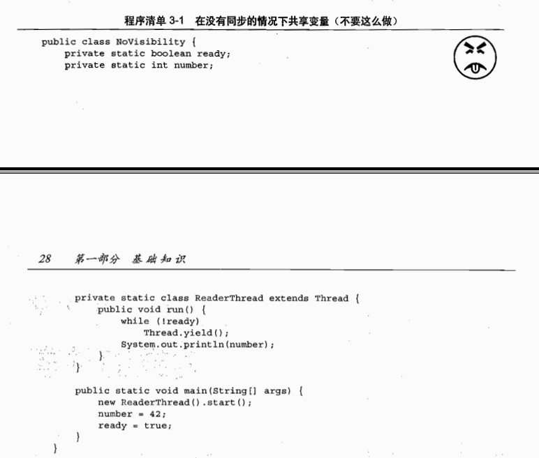

# 线程安全性
## 线程安全性
## 原子性
## 加锁机制
## 用锁来保护状态
## 活跃性与性能

# 3.对象的共享
## 3.1 可见性
synchronized 同步代码块或者同步方法可以确保以原子的方式执行操作  
synchronized不止用于实现原子性或者确定“临界区”，同时还可以确保内存可见性  
我们不仅希望防止某个线程正在使用对象状态而另一个线程在同时修改该状态，而且希望确保当一个线程修改了对象状态后，其他线程能够看到发生的状态变化。如果没有同步，那么这种情况就无法实现，你可以通过显示的同步或者类库中内置的同步来保证对象被安全的发布。  


上例线程可能会持续循环下去，因为读线程永远抢不到CPU执行，看不到ready的值  
还有一种可能是会输出0，看到这里一定很好奇，读线程如果能看到ready为true说明，number=42已经执行了。
难道说number=42 在 ready=true 之前执行？  
确实是改变了，这种现象被称为“重排序”，这看上去似乎是一种失败的设计，但事实上并非如此，JVM通过这种方式充分地利用了现代多核处理器的强大性能。例如，在缺少同步的情况下，Java内存模型允许编译器对操作顺序进行重排序，并将数值缓存在寄存器中，它还允许CPU对操作顺序进行重排序，并将数值缓存在处理器的特定缓存中。

#### 失效数据 
对写加锁，读未加锁，例如最后一件商品，有人已经下单了，但写比较慢，读比较快，你一读发现还有一件，但你一写却告诉你没了。


#### 非原子的64位操作
Java内存模型要求，变量的读取和写入都必须是原子操作  
但是对于非volatile类型的64位数值变量double和long，JVM允许将64位的操作分解为32位的操作  
如果对该变量的读操作和写操作在不同线程执行，可能读到某个值的高32位和另一个值的低32位  
因此多线程中使用共享且可变的long和double的变量也是不安全的，除非用volatile声明他们，或者加锁

#### 加锁与可见性
加锁的含义不仅仅局限于互斥行为，还包括可见性，为了确保所有线程都能看到共享变量的最新值，所有执行读写操作的线程必须在同一个锁上同步。

#### Volatile变量
内存可见性，比synchronized关键字更轻量级的同步机制，变量声明volatile后，编译器与运行时都会注意到这个变量是共享的  因此不会将该变量上的操作与其他内存操作一起重排序，volatile变量不会被缓存在寄存器和这其他处理器不可见的地方，因此每次读取的总是返回的最新写入的值，可以这样理解，之前线程都会从内存堆中取一份值然后缓存到线程内部，之后的操作都是基于线程内部的值，结束操作后将结果覆盖内存中之前读取的那个变量，这就导致一个线程在内部修改那个变量时，例如之前说的下单，这个线程其实就是最后一个买到的人，在线程内部修改了还没写入内存，所以内存中还是剩最后一件的，此时你去读的话还有，但写的时候却没了，加了volatile后，线程就不会缓存内存堆中的值到线程内部，而是直接修改内存中的值。

当且仅当满足以下所有条件时，才应该使用volatile变量
- 对变量的写入操作不依赖变量的当前值，或者确保只有一个线程更新变量的值
- 该变量不会与其他状态变量一起纳入不变性条件中
- 在访问变量时不需要加锁


## 3.2 发布与逸出
使用工厂方法来防止this引用在构造过程中逸出  
只有当构造函数返回时，this引用才应该从线程中逸出，构造函数可以将this引用保存到某个地方，只要其他线程不会在构造函数完成前使用它
```java
public static SafeListener newInstance(EventSource source){
    SafeListener safe=new SafeListener();
    source.registerListener(safe.listener);
    return safe;
}
```

## 3.3 线程封闭
通过不共享数据的方式来避免同步，相当于仅在单线程内访问数据，这种技术被称为线程封闭  
JDBC的Connection对象就使用的这种技术，Java语言及核心库提供了一些机制来帮助维持线程封闭性，例如局部变量和ThreadLocal类

## 3.4 不变性
被final 修饰的对象，不可变的是指向对象的引用，对象本身是可以被改变的。
当满足一下条件时，对象才是不可变的：
对象创建以后其状态就不能修改  
对象的所有域都是final类型  
对象是正确创建的(在对象的创建期间，this引用没有逸出)

如果不是final类型，那么要分析线程安全性将变成更复杂，如果将没被final修饰的目标，修改指向另一个域的引用，那么必须确保更新操作对于所有访问的线程都是可见的，还要确保目标值上不存在竟态条件。

final

## 3.5 安全发布
https://blog.51cto.com/zero01/2300908

# 4.对象的组合

## 4.1 设计线程安全的类

## 4.2 实例封闭
如果某个对象不是线程安全的，可以通过多种技术使其在多线程中安全的使用，可以通过单线程访问的方式，也可以通过一个锁来保护对象的所有访问。还可以将其封装到一个线程安全类中来保证其线程安全。    
面向对象的三个特性，封装、继承、多态，其中封装可以简化线程安全类的实现过程，提供了一种实例封闭机制，也可以称为实例封闭。
被封闭的对象一定不能超出它们既定的作用域，对象可以封闭在类的一个实例中（例如作为类的一个私有成员），或者封闭在某个作用域内（例如作为一个局部变量），再或者封闭在线程内（使用ThreadLocal，在某个线程中将对象中一个方法传递到另一个方法，而不是在多个线程之间共享该对象）
```java
public class PersonSet{
    private final Set<Person> mySet = new HashSet<Person>();
    public synchronized void addPerson(Person pi){
        mySet.add(pi);
    }
    public synchronized boolean containsPerson(Person p){
        return mySet.contains(p);
    }
}
```
实例封闭是构建线程安全类的一个最简单方式，它还使得在锁策略的选择上拥有更多的灵活性。  
Java类库中的Collections.synchronizedList及类似方法，通过“装饰器”模式，将非线程安全的容器封装在一个同步的包装器对象中，这个包装器对象将容器实现的接口的方法实现为同步方法，将调用请求转发到底层的非线程安全的容器对象上，只要包装器对象拥有对底层容器对象的唯一引用。那么它就是线程安全的。  
当然，如果将一个本该被封闭的对象发布或者逸出，那么也能破坏封闭性。当发布其他对象时，例如迭代器或内部的类实例，可能会间接的发布被封闭的对象，同样会使被封闭对象逸出。

## 4.3 线程安全性的委托
将线程不安全的类封装在线程安全的类中，以达到安全访问数据的目的。

## 4.4 在现有的线程安全类中添加功能

## 4.5 将同步策略文档化

# 基础构建模块

## 同步容器类
Vector HashTable  
ConcurrentModificationException 

## 并发容器
JDK5.0增加ConcurrentHashMap代替同步且基于散列的Map，CopyOnWriteArrayList，用于在遍历操作为主要操作的情况下代替同步的List，在新的ConcurrentMap接口中增加了一些常见的复合操作：若没有则添加、替换、以及有条件删除   
JDK5.0增加了两种新的容器类型：Queue和BlockQueue  
Queue  
- ConcurrentLinkedQueue
- PriorityQueue 
BlockQueue  
增加了可阻塞的插入和获取等操作  
JDK6引入了ConcurrentSkipListMap和ConcurrentSkipListSet

#### ConcurrentHashMap
使用分段锁了保证并发，ConcurrentHashMap返回的迭代器具有弱一致性，而非“及时失败”，弱一致性的迭代器可以容忍并发的修改，当创建迭代器时会遍历已有的元素，并可以（但是不保证）在迭代器被构造后将修改操作反映给容器  
对于一些需要在整个Map上进行计算的方法，例如size和isEmpty，由于size返回的结果在计算时可能已经过期了，它实际上只是一个估计值，因此允许size返回一个近似值而不是一个精确值，因为在并发的环境下用处很小，所以这些操作的需求被弱化了，以换取对其他更重要操作的性能优化，包括：get、put、containsKey、remove等  

#### 额外的原子Map操作
V putIfAbsent(K key,V value)    仅当K没有相应的映射值时才插入
boolean remove(K key,V value)   仅当K被映射到V才移除
boolean replace(K key, V oldValue,V newValue)   仅当K被映射到oldValue时才替换newValue
V replace(K key,V newValue) 仅当K被映射到某个值时才替换为newValue

#### CopyOnWriteArrayList
替代同步List，提供更好的并发性能，并且迭代期间不需要对容器进行加锁或复制，仅当迭代操作远远多于修改操作使用  
每次修改时，都会创建并重新发布一个新的容器副本，从而实现可变性，“写入时复制”容器的迭代器保留一个指向底层基础数组的引用，这个数组当前位于迭代器的起始位置，由于它不会被修改，因此多个线程可以同时对这个容器进行迭代，而不会彼此干扰或者与修改容器的线程互相干扰，这个迭代器不会抛出ConcurrentModificationException，且返回的元素与迭代器创建时的元素一直，不必考虑修改操作带来的影响


## 阻塞队列和生产者-消费者模式
生产者-消费者模式 能简化开发过程，消除了生产者和消费者之间的代码依赖性，将生产数据和使用数据的过程解耦来简化工作负载的管理，因为这两个过程在处理数据的速率上有所不同。  
- LinkedBlockingQueue  
- ArrayBlockingQueue  
- PriorityBlockingQueue 按照优先级排序的队列，按照某种顺序而不是FIFO来处理元素，可以使用Comparator来比较  
- SynchronousQueue 实际上它不是一个真正的队列，因为它不会为队列中元素维护存储空间，与其他队列不同的是，它维护一组线程，这些线程正在等待把元素加入或者移除队列，因为SynchronousQueue没有存储功能，因此put和take会一直阻塞，直到有另一个线程已经准备好参与到交付过程中，仅当有足够多的消费者，并且总是有一个消费者准备好获取交付的工作时，才适合使用同步队列

#### 双端队列和工作密取
Deque和BlockDeque分别对Queue和BlockingQueue进行了扩展，Deque是一个双端队列，实现了队列头和队列尾的高效插入和移除，具体实现ArrayDeque和LinkedBlockingDeque  
工作密取设计中，每个消费者都有各自的双端队列，如果一个消费者完成了自己的全部工作，那么它可以去其他消费者的双端队列末尾秘密获取工作，如果从其队头获取工作的话可能发生竞争

## 阻塞方法与中断方法
线程可能会阻塞或暂停执行，原因有多种：等待I/O操作的结束，等待获取锁，等待从Thread.sleep方法中醒来，或者是等待另一个线程的计算结果。  
中断是一种协作机制。

## 同步工具类
同步工具类可以是任何一个对象，只要它可以根据自身的状态来协调线程的控制流
- 阻塞队列
- 信号量（Semaphore）
- 栅栏（Barrier）
- 闭锁（Latch）

#### 闭锁
闭锁是一种同步工具类，可以延迟线程的进度直到其达到终止状态，可以用来启动一组相关操作，或者等待一组相关操作结束。  
闭锁相当于一扇门，在闭锁到达结束状态前，这扇门一直是关闭的，并且没有任何线程能通过，当到达结束状态时，门会打开并允许所有线程通过。
CountDownLatch
```java
public long timeTasks(int nThreads, final Runnable task){
    final CountDownLatch startGate = new CountDownLatch(1);
    final COuntDownLatch endGate = new CountDownLatch(nThreads);
    for(int i=0;i<nThreads;i++){
        Thread t = new Thread(){
            public void run(){
                try{
                    startGate.await();
                    try{
                        // Runnable task
                        task.run();
                    }finally{
                        endGate.countDown();
                    }
                }catch (InterruptedException ignored){}
            }
        };
        t.start();
    }
    //让所有的线程先启动好，进入阻塞，主线程等到所有线程ok后，打开startGate
    //记录n个线程在并发情况下执行任务的耗时
    long start = System.nanoTime();
    startGate.coutnDown();
    endGate.await();
    long end = System.nanoTime();
    return end-start;
}
```
#### FutureTask
FutureTask也可以用来做闭锁，FutureTask是通过Callable来实现的，相当于一种可生成结果的Runnable  
状态：等待运行、正在运行和运行完成， 执行完成表示计算所有可能的结束方式，如正常结束、由于取消而结束和由于异常而结束，当FutrueTask进入完成状态后，会永远停止在这个状态上。  
Future.get()取决于任务状态，任务完成，那么get会立即返回结果，否则get将阻塞直到任务进入完成状态，然后返回结果或者抛出异常。

#### 信号量
技术信号量用来控制同时访问某个特定资源的操作数量，或者执行某个指定操作的数量。还可以用来实现某种资源池，或者对容器施加边界。  
Semaphore中管理着一组虚拟的许可（permit），可以构造指定初始数量，在执行操作前需要获取许可，使用后释放，如果没有获取到，acquire方法将阻塞直到有许可（或者被中断或者操作超时），release方法将返回一个许可给信号量。

#### 栅栏
闭锁是一次性对象，一旦进入终止状态，就不能被重置。  
栅栏（Barrier）类似于闭锁，它能阻塞一组线程直到某个事件发生，栅栏和闭锁的区别在于，所有线程必须同时到达栅栏位置，才能继续执行。闭锁用于等待事件，而栅栏用于等待其他线程。  
CyclicBarrierCyclicBarrier
CyclicBarrier可以使一定量数量的参与方反复的在栅栏位置汇集，它在并行迭代算法中非常有用：这种算法通常将一个问题拆分成一系列相互独立的子问题，当线程到达栅栏位置时调用await方法，这个方法将阻塞直到所有线程都到达栅栏位置。如果所有线程都到了，那么栅栏打开，此时所有线程都被释放，栅栏重置以便下次使用。  
如果对await调用超时，或者await阻塞的线程被中断，那么就认为栅栏被打破了，所有阻塞的await调用都将终止并抛出BrokenBarrierException。  
栅栏构造器中还支持传入一个Runnable，当成功通过栅栏时会在一个子任务中执行它，在释放前是不会执行的。

>在不涉及I/O操作或共享访问的计算问题中，当线程数量和CPU核心相同时或差1个时将获得最优的吞吐量，更多的线程并不会带来任何帮助，甚至在某种程度上会降低性能，因为多个线程会在CPU和内存等资源上发生竞争

## 构建高效且可伸缩的结果缓存
- HashMap<A,V>
- ConcurrentHashMap<A,V>
- ConcurrentHashMap<A,Future<V>>
- ConcurrentHashMap<A,Future<V>>  
    使用putIfAbsent来代替非原子的“先检查后执行”操作
    ```java
    FutureTask<V> ft = new FutureTask<V>(eval);
    f = cache.putIfAbsent(arg,ft); //不存在则插入，存在则返回null
    if(f==null){
        f=ft;
        ft.run();
    }
    ```

# 第一部分小结
- 可变状态是至关重要的。所有并发问题都可以归纳为如何协调对并发状态的访问，可变状态越少，线程越安全
- 尽量将域声明为final类型，除非需要它们是可变的
- 不可变的对象一定是线程安全的，不可变的对象能极大地降低并发编程的复杂性。它们更为简单而且安全，可以任意共享而无须使用加锁或保护性复制等机制
- 封装有助于管理复杂性。 在编写线程安全的程序时，虽然可以将所有数据都保存在全局变量中，但将数据封装在对象中，更易于维持不变性条件：将同步机制封装在对象中，更易于遵循同步策略
- 用锁来保护每个可变变量
- 当保护同一个不变性条件中的所有变量时，要使用同一个锁
- 在执行复合操作期间，要持有锁，如i++、先检查后执行
- 如果从多个线程中访问同一个可变变量时没有同步机制，那么程序会出现问题
- 不要故作聪明地推断出不需要使用同步
- 在设计过程中考虑线程安全，或者在文档中明确指出它不是线程安全的
- 将同步策略文档化