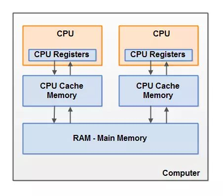
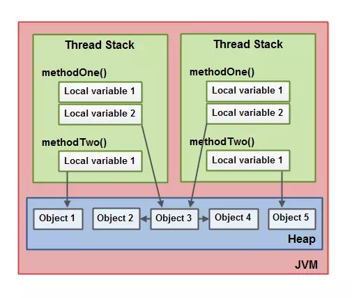
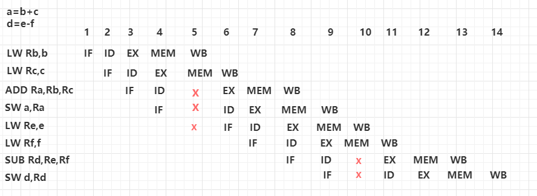

## 前言： 
在上一篇中频繁出现“锁”这个关键字，对于锁大家都有各自的理解，本篇将阐述用锁来解决什么问题，以及这些问题的来源。在开篇会讲解硬件中的内存架构以便更好的理解Java中的内存结构。

## 面试问题


## 1.硬件内存架构、Java内存结构和Java内存模型
### 1.1硬件内存架构



CPU <=> 寄存器 <=> 缓存 <=> 主内存

**CPU寄存器**：寄存器是CPU内的组成部份。是CPU运算时取指令和数据的地方，寄存器是有限存贮容量的高速存贮部件。CPU访问寄存器的速度远远大于主内存。
> 每个CPU都包含一系列的寄存器，包含的寄存器有指令寄存器(IR)和程序计数器(PC)。在中央处理器的算术及逻辑部件中，包含的寄存器有累加器(ACC)。


**高速缓存Cache**：高速缓存Cache位于CPU与主内存间的一种容量较小但速度很高的存储器。由于CPU与主内存的运算速度之间有着几个数量级的差距，所以加入读写速度尽可能接近处理器运算速度的高速缓存来作为内存与处理器之间的缓冲。
将运算需要使用到的数据复制到缓存中，让运算能快速进行，当运算结束后再从缓存同步回内存之中，这样处理器就无须等待缓慢的内存读写了。
每个CPU可以有多个CPU缓存层。在某一时刻，一个或者多个缓存行（cache lines）可能被读到缓存，一个或者多个缓存行可能再被刷新回主存。

**主内存**：所有的CPU都可以访问主存。主存通常比CPU中的缓存大得多。用于存放数据的单元。其作用是用于暂时存放CPU中的运算数据，以及与硬盘等外部存储器交换的数据。

**运作原理**：通常情况下，当一个CPU需要读取主存时，它会将主存的部分读到CPU缓存中。它甚至可能将缓存中的部分内容读到它的内部寄存器中，然后在寄存器中执行操作。当CPU需要将结果写回到主存中去时，它会将内部寄存器的值刷新到缓存中，然后在某个时间点将值刷新回主存，在刷回主存前缓存的值将对其他CPU不可见。


### 1.2Java内存结构
注意这里说的是Java内存结构，而不是Java内存模型，这两个是不同的概念，Java内存结构指的是JVM的内存分区，Java内存模型则为了解决多线程对共享数据访问而建立的抽象模型。


- 存储基本类型的本地变量会被保存在线程栈中。
- 存储一个堆中对象地址的本地变量，这个本地变量（也叫做对象的引用）存放在线程栈中。
- 存储在堆中的对象，其方法的本地变量也存放在线程栈中。但是对象中的成员变量跟着对象自身存放在堆中，无论该成员变量是基础类型还是引用类型。
- 静态成员变量跟随着类定义一起也存放在堆上。
- 存放在堆上的对象可以通过指向这个对象的引用来访问。

### 1.3Java内存模型
**Java内存模型简介**
Java内存模型(Java Memory Model)是通过各种操作来定义的，包括对变量的读/写操作，监视器的加锁和释放操作，以及线程的启动和合并操作。JMM是和多线程相关的，JMM为程序中所有的操作定义了一个偏序关系，称为Happens-Before。要想保证执行操作B的线程看到操作A的结果，无论A和B是否在同一个线程中执行，那么A和B之间必须满足Happens-Before关系。如果两个操作之间缺乏Happens-Before关系，那么JVM可以对它们任意的排序。

那么，简单总结下，Java的多线程之间是通过共享内存进行通信的，而由于采用共享内存进行通信，在通信过程中会存在一系列如可见性、原子性、顺序性等问题，而JMM就是围绕着多线程通信以及与其相关的一系列特性而建立的模型。JMM定义了一些语法集，这些语法集映射到Java语言中就是volatile、synchronized等关键字。

**Java内存结构和硬件内存架构之间的桥接**
Java内存结构与硬件内存架构之间存在差异。硬件内存架构没有区分线程栈和堆。对于硬件，所有的线程栈和堆都分布在主内存中。部分线程栈和堆可能有时候会出现在CPU缓存中和CPU内部的寄存器中。如下图所示：


从抽象的角度来看，JMM定义了线程和主内存之间的抽象关系：


- 线程之间的共享变量存储在主内存（Main Memory）。
- 每个线程都有一个私有的本地内存（Local Memory），本地内存是JMM的一个抽象概念，并不真实存在，它涵盖了缓存、写缓冲区、寄存器以及其他的硬件和编译器优化。本地内存中存储了该线程以读/写共享变量的拷贝副本。
从更低的层次来说，主内存就是硬件的内存，而为了获取更好的运行速度，虚拟机及硬件系统可能会让工作内存优先存储于寄存器和高速缓存中。
- Java内存模型中的线程的工作内存（working memory）是cpu的寄存器和高速缓存的抽象描述。而Java内结构(JVM的内存分区)只是一种对内存的物理划分，而且只局限在JVM的内存。


## 2.并发编程常见问题来源
### 2.1原子性问题
我们知道线程在分配到CPU时间片后才能继续执行，这种分时复用CPU的方式，使得程序中一个线程在等待 I/O 操作结束的时侯，另一个线程可以继续运行。当然更多的时候可能是多个线程交替执行。交替的时机大多是在时间片结束，交替前CPU会执行完当前的CPU指令，注意，这里是CPU指令，并不是Java中的一条语句，高级语言中
的一条语句往往需要多条CPU指令完成，例如i++，至少需要三条CPU指令：

- 指令1：把i的值从内存加载到CPU寄存器；
- 指令2：在CPU寄存器中进行+1操作；
- 指令3：将结果写回内存；

原子性的特点是不可分割，但上面的每一条指令结束都有可能发生线程切换，如果在指令1结束后线程切换，新线程修改了内存中i的值，随后切回当前线程继续执行指令2，这三条指令的执行就被其他线程分割，因此i++操作不具有原子性。还需要注意的是CPU能保证的原子性是CPU指令级别的，而不是高级语言的一条执行语句。大部分情况下我们要保证的原子性是高级语言层面的。
接下来用一个示例展示原子性问题，两个线程对同一个变量 i 执行i++操作：

执行两次i++，应该是2，但结果却是1。

i++操作的CPU指令，是一个“读取-修改-写入”的操作序列，它的结果依赖于之前读取的状态，由于不具备原子性，导致读取的状态可能失效，基于一个失效的状态产生的结果必然是不正确的。这种由于不恰当的执行时序而出现的不正确的结果的情况被称为**竟态条件**（Race Condition），还用一种常见的竟态条件类型，“先检查后执行”。

**非原子的64位操作**
Java内存模型要求，变量的读取和写入都必须是原子操作  
但是对于非volatile类型的64位数值变量double和long，32位操作系统中的JVM允许将64位的操作分解为32位的操作，如果对该变量的读操作和写操作在不同线程执行，可能读到某个值的高32位和另一个值的低32位，因此多线程中使用共享且可变的long和double的变量也是不安全的，除非用volatile声明他们，或者加锁。


### 2.2可见性问题
线程对共享变量修改的可见性。当一个线程修改了共享变量的值，其他线程能够立刻得知这个修改。
在单核CPU的多个线程，共同操作同一个CPU缓存（高速缓存cache），一个线程对缓存的写，对另外一个线程一定可见。
在多核CPU的多线程环境下，每个CPU都有自己的CPU缓存。CPU缓存不会与内存实时同步，Thread1对CPU1cache的操作，Thread2对CPU2cache操作，所以两个线程之间的操作对彼此是不可见的。这也是前边示例结果不正确的原因之一。

可见性问题不仅会发生在CPU缓存上，还会发生在虚拟机层面。  


### 2.3有序性问题
近些年计算机性能的提升原因除了时钟频率的提高，其他很大程度上归功于指令重排序措施，在编译器中生成的指令顺序，可以与源代码中的顺序不同。
**指令重排序**
一行高级语言的语句可以拆分为多个指令，而一个指令还可以拆分为多个小步骤。可以简化为 IF ID EX MEM WB 。 IF：取指令阶段是将一条指令从主存中取到指令寄存器的过程。
ID：取出指令后，计算机立即进入指令译码阶段。指令译码器对取回的指令进行拆分和解释。
EX：在取指令和指令译码阶段之后，接着进入执行指令阶段。完成指令所规定的各种操作，因此CPU的不同部分被连接起来，输入端提供需要相加的数值，而输出端将含有最后的运算结果。
MEM：可能要访问主存读取操作数，这样就进入了访存取数阶段。该阶段会根据指令地址码，得到操作数在主存中的地址，并从主存中读取该操作数用于运算。
WB：结果写回阶段把执行指令阶段的运行结果数据写回，可能会写到CPU内部寄存器中，或者主存。

上面的每个步骤都会有对应的部件,这些部件相当于流水线上的工人，IF一直在取指，ID一直在译码，有的部件有时候可能无法跟上前边的速度，下图中，如果执行“ADD Ra,Rb,Rc” 指令时，上一条指令的MEM步骤还没有返回，所以当前指令的EX步骤无法继续执行，存在一个“空档期”(红色的X)，直到前一个MEM步骤完成时当前的EX步骤才会继续执行，CPU执行完这两条语句需要14个机器周期。其中2个机器周期是由于“空档期”所导致的，不要因为是2个就小看它，量变引起质变，优化这个“空档期”问题，可能会使CPU有10%的性能提升。

接下来该指令重排序登场了，指令重排是改变指令的的执行顺序，来填补这些“空档期”，但是指令重排不能改变程序语义的串行性，也就是说有A依赖B的结果，那么A不会被排在B前边，示例中变量间没有依赖性，因此允许编译器和CPU进行指令重排，重排序过程不会影响到单线程程序的执行，却会影响到多线程并发执行的正确性，因为多线程之间的变量依赖关系编译器和CPU是不知道的。
下面为重排序后的指令执行顺序，将“LW Re,e” 调整到“ADD Ra,Rb,Rc”之前，这样在执行EX步骤的时候需要的值已经准备好了。也就不存在“空档期”了。CPU执行完这两条语句需要12个机器周期，比之前快了2个机器周期。


**有序性问题的原因**
凡事都有利弊，性能提高的同时也带来了有序性问题，前面的优化只提前了一条语句的部分指令，如果将一条语句的全部指令提前，那么就相当于这条语句被提前执行了。这种情况结合之前的原子性就会发生意想不到的问题，如下图：
```java
public class OrderExample{
    int a = 0;
    boolean flag = false;
    public void writer(){
        a = 1;
        flag = true;
    }
    public int reader(){
        if(flag){
            return a;
        }
        return -1;
    }
}
```
两个线程分别执行writer()和reader(),预期的结果是1或-1，但实际还有可能为0，是重排序可能导致 "flag = true"先于"a = 1"执行，因为在执行writer()线程的CPU中，觉得这两条语句没有关联，调换一下顺序也没毛病，换完后执行了"flag = true"，并将结果刷回内存，就去干别的事了，回头再来执行"a = 1"，此时执行reader()线程的CPU开始干活了，先判断flag为true，返回当前内存中的a，a没来得及被修改，所以还是0，于是出现了预期之外的结果，这个就是有序性导致的问题。

前面是两条语句之间发生指令重排导致的有序性问题，一条语句的内的指令重排也会造成有序性问题。

**双重检查锁**
```java
    public class SingleClass{
        private static Resource resource;
        public static Resource getInstance(){
            if(resource == null){
                synchronized(this){
                    if(resource == null){
                        resource = new Resource();
                    }
                }
            }
            return resource;
        }
    }
```
上例是利用双重检查创建单例对象，可能会发布一个部分构建的实例，在于new Resource()的执行过程中发生重排序。

我们以为的new 操作：
- 1.分配一块内存M；
- 2.在内存M上初始化Resource对象；
- 3.将M的地址赋值给resource变量；

实际优化后的执行顺序：
- 1.分配一块内存M；
- 2.将M的地址赋值给resource变量；
- 3.在内存M上初始化Resource对象；

这样就导致，在第2步执行后，resource就指向一块内存地址，其他线程调用getInstance的时候，resource != null，返回了一个未被初始化或者被部分初始化的单例，在实际使用中可能会出现空指针异常。
在JDK5之后，将resource声明为volatile类型，就可以使用双重检查锁了，因为volatile禁止了指令重排序，volatile变量的读取操作性能通常只是略高于非volatile变量读取性能操作。


## 3.Java如何解决并发问题
这个答案就是Java内存模型，前面简单介绍了JMM，其中“Happens-Before”规则


### Happen-Before
- 程序顺序原则：一个线程内保证语义的串行性
- volatile规则：volatile变量的写，先发生于读，这保证了volatile变量的可见性
- 锁规则：解锁必然发生在随后的加锁前
- 传递性：A先于B，B先于C，那么A必先于C
- 线程的start()先于它的每一个动作
- 线程的所有操作先于线程的终结(Thread.join()) 
- 线程的中断先于被中断线程的代码
- 对象的构造函数执行结束先于finalize()方法

### 线程安全的概念
指某个函数在多线程环境中被调用时，能够正确地处理各个线程的局部变量，使程序正确完成
线程安全：多线程访问某个类时，这个类始终都能表现出正确的行为，那么就称这个类是线程安全的

14. 如何实现线程同步
    (1) synchronized 关键字，修饰代码块、方法或静态方法
        同步是一种高开销的操作，因此应该尽量减少同步的内容。通常没有必要同步整个方法，使用synchronized代码块同步关键代码即可。
    (2) ReentrantLock 
        在Java5中新增了java.util.concurrent包来支持同步。ReentrantLock类是可重入、互斥、实现了Lock接口的锁，它与使用synchronized方法和块具有相同的基本行为和语义，并且扩展了其能力。
        ReentrantLock类的常用方法有：
        ReentrantLock()：创建一个ReentrantLock实例；
        lock()：获得锁；
        unlock()：释放锁；
        注：ReentrantLock还有一个可以创建公平锁的构造方法，但由于会大幅降低程序运行效率，不推荐使用。

    (3) ThreadLocal 实现线程同步
        使用ThreadLocal管理变量，则每个使用该变量的线程都获得该变量的一个副本，副本之间相互独立，这样每个线程都可以随意更改自己的变量副本，而不会对其它线程产生影响。
  

## 死锁
产生死锁的4个条件  
- 互斥条件，使用的资源无法共享
- 至少有一个任务必须持有资源且正在等待获取一个被别的任务持有的资源
- 资源不能被其他任务抢占
- 循环等待，A等待B、B等待A

10. 什么是线程死锁?如何避免死锁?
    产生死锁必须具备以下四个条件：
        互斥条件：该资源任意一个时刻只由一个线程占用。
        请求与保持条件：一个进程因请求资源而阻塞时，对已获得的资源保持不放。
        不剥夺条件:线程已获得的资源在末使用完之前不能被其他线程强行剥夺，只有自己使用完毕后才释放资源。
        循环等待条件:若干进程之间形成一种头尾相接的循环等待资源关系。
        破坏互斥条件
        如何避免线程死锁?
        破坏互斥条件        这个条件我们没有办法破坏，因为我们用锁本来就是想让他们互斥的（临界资源需要互斥访问）。
        破坏请求与保持条件  一次性申请所有的资源。(极大的降低资源利用率)
        破坏不剥夺条件      占用部分资源的线程进一步申请其他资源时，如果申请不到，可以主动释放它占有的资源。(自己申请不到，就主动释放自己的资源)
        破坏循环等待条件    靠按序申请资源来预防。按某一顺序申请资源，释放资源则反序释放。破坏循环等待条件。(按顺序访问资源，降低资源利用率)

18. 什么是线程安全，Servlet、变量是线程安全的吗
    线程安全：如果你的代码在多线程下执行和单线程下执行永远都能获得一样的结果，那么你的代码就是线程安全的。
    线程安全问题都是由全局变量及静态变量引起。若每个线程中对全局变量、静态变量只有读操作，而无写操作，一般来说，这是线程安全的；若有多个线程同时执行写操作，一般都需要考虑线程同步，否则就可能影响线程安全。
    Servlet不是线程安全的，Servlet是单实例多线程的，当多个线程同时访问同一个方法，是不能保证共享变量的线程安全的；
    静态变量：线程非安全。static变量被所有实例共享，当声明类变量时，不会生成static变量的副本，而是类的所有实例共享同一个static变量。一旦值被修改，其它对象均对修改可见，因此线程非安全。
    实例变量：单例时线程非安全，非单例时线程安全。实例变量是实例对象私有的，若系统中只存在一个实例对象，则在多线程下，值改变则对其它对象都可见，所以线程非安全的；每个线程都在不同实例对象中执行，则对象之间的修改互不影响，线程安全。
    局部变量：线程安全。定义在方法内部的变量，线程间不共享。
    静态方法：方法中如果没有使用静态变量，就没有线程安全问题；静态方法内部的变量是局部变量。


24. synchronized与ThreadLocal的比较
    （1）ThreadLocal使用场合主要解决多线程中数据因并发产生的不一致问题。ThreadLocal为每个线程中并发访问的数据提供一个副本，通过访问副本来运行业务，这样的结果是耗费了内存，但大大减少了线程同步所带来的性能消耗，也减少了线程并发控制的复杂度；

    （2）ThreadLocal不能使用原子类型，只能使用Object类型。ThreadLocal的使用要比synchronized简单得多；

    （3）ThreadLocal和synchronized都用于解决多线程并发的访问，但是二者有本质区别：synchronized是利用锁的机制，使变量或代码块在某一时刻只能被一个线程访问，而ThreadLocal为每一个线程都提供了变量的副本，使每个线程在某一时间访问到的并不是同一个对象，这样就隔离了多个线程对数据的共享。而synchronized却正好相反，它用于多个线程间通信时能够获取数据共享；

    （4）同步会带来巨大的性能开销，所以同步操作应该是细粒度的（对象中的不同元素使用不同的锁，而不是整个对象一个锁），如果同步使用得当，带来的性能开销是微不足道的，使用同步真正的风险是复杂性和可能破坏资源安全，而不是性能；

    （5）synchronized用于线程间的数据共享，ThreadLocal用于线程间的数据隔离。
    ThreadLocal：数据隔离，适合多个线程需要多次使用同一个对象，并且需要该对象具有相同的初始化值时；
    synchronized：数据同步，当多个线程想访问或修改同一个对象，需要阻塞其它线程从而只允许其中一个线程对其进行访问与修改。

3:线程抛出异常会释放锁吗?
程序在执行过程中,如果出现异常,默认情况锁会被释放,
所以,在并发处理的过程中,有异常要多加小心,不然可能会发生不一致的情况。
如,在一个web app处理过程中, 多个servlet线程共同访问同一个资源,这时如果异常处理不合适
在第一个线程中抛出异常,其他线程就会进入同步代码区,有可能会访问到异常产生时的数据。
解决方法 copyonwrite

4: volatile和synchronized区别?
synchronized 锁的其实是 对象，加在方法上锁的是this对象，加在static方法上，则锁的是class的字节码对象
synchronized 保证原子性和可见性  volatile 保证可见性 
volatile 关键字,使一个变量在多个线程间可见
A B线程都用到一个变量, java默认是A线程中保留一份copy,这样如果B线程修改了该变量,则A线程未必知道!
使用volatile关键字,会让所有线程都会读到变量的修改值!
不加锁，不使用volatile的情况下 如果A修改了变量，B线程如果不忙的话，比如让B线程休眠，则B线程可能会去内存更新数据，
在下面的代码中, running是存在于堆内存的t对象中,当线程t1开始运行的时候,会把running值从内存中读到t1线程的工作区,
在运行过程中直接使用这个copy,并不会每次去读取堆内存,这样,当主线程修改running的值后, t1线程感知不到,所以不会停止运行
使用volatile,将会强制所有线程都去堆内存中读取running的值/ 当值被修改后，强制所有线程去堆内存中刷新该值
可以阅读这篇文章进行更深入的理解https://www.cnblogs.com/nexiyi/p/java_memory_model_and_thread.html
volatile并不能保证多个线程共同修改running变量时所带来的不一致问题,也就是说volatile不能代替synchronized
wait 释放锁   notify/notifyAll 不释放锁  必须在同步的情况下使用
Object lock= new Object();
lock.wait();

ThreadLoacl
ThreadLocal线程局部变量 ThreadLocal是使用空间换时间, synchronized是使用时间换空间
比如在hibernate中session就存在与ThreadLocal中,避免synchronized的使用

思考题
1: A线程正在执行一个对象中的同步方法, B线程是否可以同时执行同一个对象中的非同步方法?    
可以，两者不冲突

2:同上, B线程是否可以同时执行同一个对象中的另一个同步方法?  
一个同步方法可以调用另外一个同步方法，一个线程已经拥有了某个对象的锁，再次申请的时候仍然会得到该对象的锁
也就是说synchronized获得的锁是可重入的， 子类的synchronized方法可以访问父类的synchronoized方法


jps 查看当前的Java进程、
jstack JVM自带的堆栈跟踪工具

**synchronized**  
同步方法只影响锁定同一个锁对象的同步方法。不影响其他线程调用非同步方法，或调用其他锁资源的同步方法。
锁重入：父类可以重入之类构造，子类先拿锁，父类可以重入
线程本来能够运行，但由于等待获取某个锁而阻止它的运行  
指定加锁对象：对指定对象加锁，进入同步代码块前要获得给定对象的锁  
直接作用于实例方法：相当于对当前实例加锁，进入同步代码块前要获得当前实例的锁，锁的是实例对象  
直接作用于静态方法：相当于对当前类加锁，进入同步代码块前要获得当前类的锁，锁的是字节码对象除非封装为包装类，加在方法上，锁的是调用这个方法的实例对象，加在静态方法上，锁的其实是该类对应的字节码对象，而且等待和唤醒必须是同一个锁所以不能对基础类型加锁，

**volatile**
只能保证可见性，不能保证原子性


## Reference
&emsp;&emsp;《Java 并发编程实战》  
&emsp;&emsp;《Java 编程思想(第4版)》  
&emsp;&emsp;
&emsp;&emsp;https://zhuanlan.zhihu.com/p/29881777
&emsp;&emsp;https://time.geekbang.org/column/intro/159
&emsp;&emsp;https://www.cnblogs.com/dolphin0520/p/3920373.html

### 不成体系的知识，犹如一块满身是孔的奶酪。
### 感谢阅读！
