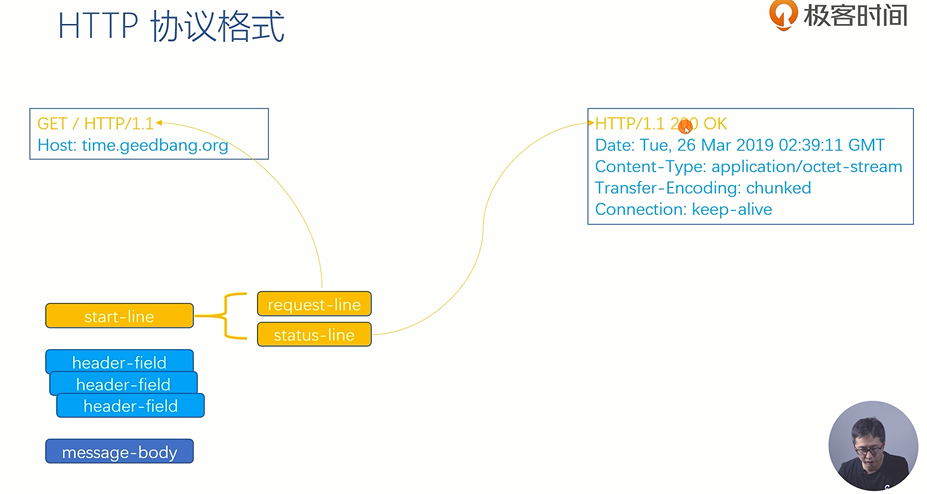
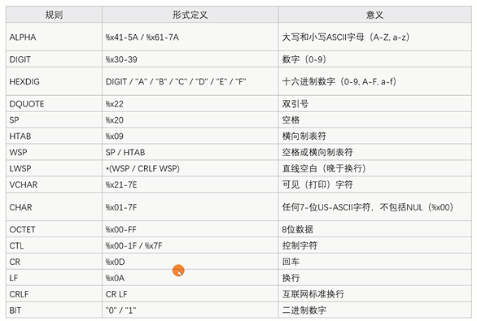

### 浏览器发起HTTP请求的典型场景

大致流程：

1. 用户通过浏览器输入框输入URL，交由浏览器引擎进行后续处理
2. 浏览器引擎会从其内部存储（浏览器的轻量级数据库）中查找是否有相关资源，没有则会去相关站点请求资源
3. 请求资源并渲染展示给用户是由渲染引擎完成的，通过网络请求到相关资源如html、css、Js、图片。Js解释器同时也会解释执行html中的相关Js代码，最后交由UI后端将完整的页面绘制到用户界面中

### Hypertext Transfer Protocol（HTTP）协议

一种无状态的、应用层、以请求/应答方式运行的协议，它使用可扩展的语义和自描述消息格式，与

基于网络的超文本信息系统灵活的互动。

- 无状态：前一个请求与后一个请求没有关联，后一个请求无法使用前一个请求的信息。
- 请求/应答方式：是基于连接的工作方式，从客户端发起一个请求，由服务端给出响应。
- 可扩展： 新版本的协议兼容老版本。
- 自描述消息格式：通过请求url可以知道请求的文件格式

### HTTP 协议格式

### ABNF（扩充巴科斯-瑙尔范式）操作符

类似于正则表达式，可以规范定义HTTP协议。

### ABNF（扩充巴科斯-瑙尔范式）核心规则

### 基于ABNF描述的HTTP协议格式

